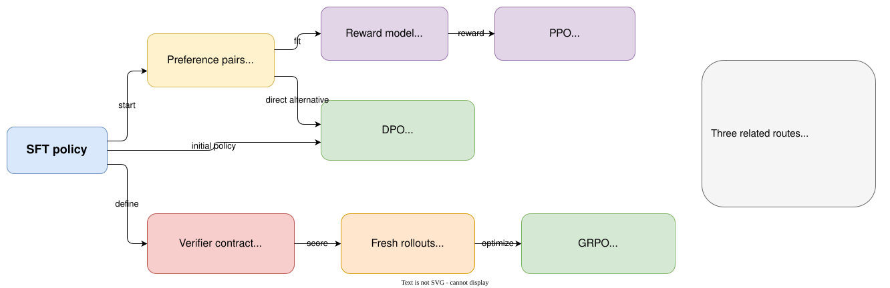

# Course map: from tokens to agent systems

## Learning objectives

After reading this map, you should be able to:

- locate every NanoPT concept, implementation, lab, and retained reference result;
- distinguish local teaching exercises from measured GPU and Docker evidence;
- choose a reading path without needing to understand the project's development milestones;
- trace the Base → SFT → DPO → GRPO lineage before changing a checkpoint.

## How to use the course

Start with [Getting Started](../getting-started/index.md), then repeat the same learning loop:

1. **Read** the concept and follow its small numerical example.
2. **Run the concept lab** on CPU to inspect the invariant without model-download or hardware noise.
3. **Run the integrated checkpoint** on a consumer GPU when the concept joins a complete model path.
4. **Inspect the artifacts and retained evidence** instead of trusting a final scalar alone.

CPU labs teach mechanisms; they do not replace model training. Consumer-GPU checkpoints prove that
the connected system loads, trains, evaluates, and stays within the measured memory envelope.

## How the post-training methods relate

The documentation order teaches the traditional reward-model-and-PPO route before DPO, because DPO
is easier to understand as an alternative to that route. The executable NanoPT pipeline can still
take the shorter SFT → DPO → GRPO path.



_The branches share foundations but consume different evidence: preference pairs for DPO, learned
scores for traditional PPO, and fresh verified rollouts for GRPO._

## Consumer-GPU checkpoints

The supported path uses the pinned small base model and was measured on one consumer GPU with 16 GB
VRAM. Run these scripts from a clean checkout. They create fresh locked environments and write
reviewable outputs under the ignored `artifacts/tmp/` tree. Agent checkpoints also require Docker
and the pinned sandbox image.

| Checkpoint | What you run | What it proves | Retained evidence |
| --- | --- | --- | --- |
| Base model and evaluation | `./scripts/run_m3_reference_smoke.sh` | Model loading, exact generation, parsing, and protected evaluation | [Base-model report](../reference/m3-completion-report.md) |
| Supervised fine-tuning | `./scripts/run_m4_reference_sft.sh` | Completion-only LoRA training and adapter evaluation | [SFT report](../reference/m4-completion-report.md) |
| Direct Preference Optimization | `./scripts/run_m5_reference_dpo.sh SFT_ADAPTER_DIR` | Preference construction, reference cache, DPO update, and comparison | [DPO report](../reference/m5-completion-report.md) |
| GRPO and RLVR | `./scripts/run_m6_reference_grpo.sh DPO_ADAPTER_DIR` | Fresh exact-token rollouts, grouped advantages, clipped updates, and evaluation | [GRPO report](../reference/m6-completion-report.md) |
| Complete math pipeline | `./scripts/run_m7_reference_pipeline.sh` | Fresh Base → SFT → DPO → GRPO lineage and resumability | [Pipeline report](../reference/m7-completion-report.md) |
| Agent environment | `./scripts/run_m8_reference_agent.sh` | Model tool use, hidden verification, Docker isolation, and security probes | [Agent-environment report](../reference/m8-completion-report.md) |
| Agent SFT | `./scripts/run_v0_2_agent_sft.sh` | Replay-linked demonstrations, exact action masks, training, and Docker evaluation | [Agent SFT report](../reference/v0.2-agent-sft-report.md) |
| Mini Agent RL | `./scripts/run_v0_3_agent_rl.sh AGENT_SFT_ADAPTER` | Grouped agent rollouts, hidden outcomes, fresh-data admission, and policy selection | [Agent RL report](../reference/v0.3-agent-rl-report.md) |

`SFT_ADAPTER_DIR`, `DPO_ADAPTER_DIR`, and `AGENT_SFT_ADAPTER` are outputs from the preceding
checkpoint. The complete math-pipeline script is the simplest way to reproduce Base through GRPO
without manually passing those boundaries.

## Chapter roadmap

The last column makes each small exercise's destination explicit. “Integrated later” means the
concept is exercised inside the named consumer-GPU checkpoint rather than receiving a redundant
standalone model run.

| Chapter | Topic | Concept practice | Consumer-GPU connection |
| ---: | --- | --- | --- |
| 0 | Course map and lineage | CPU · lab 18 | Complete math pipeline |
| 1 | [Tokens and log probabilities](../foundations/tokens-masks-logprobs.md) | CPU · labs 01–02 | Used by every model checkpoint |
| 2 | [Optimization and LoRA](../foundations/optimization-and-lora.md) | CPU · lab 19 | Integrated into SFT, DPO, GRPO, and agent training |
| 3 | [Evaluation before training](../evaluation/exact-generation-and-reports.md) | CPU · lab 06 | Base model and evaluation |
| 4 | [Supervised fine-tuning](../sft/completion-only-training.md) | CPU · lab 07 | Supervised fine-tuning |
| 5 | [Preference data](../preferences/controlled-preferences.md) | CPU · lab 08 | Integrated into DPO |
| 6 | [Reward models](../preferences/reward-models.md) | CPU · lab 11 | Optional background; the NanoPT DPO path needs no trained reward model |
| 7 | [DPO](../preferences/dpo-training.md) | CPU · lab 03 | Direct Preference Optimization |
| 8 | [RL foundations](../rl/reinforcement-learning-foundations.md) | Worked CPU examples | Integrated into GRPO and Agent RL |
| 9 | [REINFORCE](../rl/reinforce.md) | CPU · lab 12 | Score-function principle used by GRPO and Agent RL |
| 10 | [PPO](../rl/ppo.md) | CPU · lab 13 | Clipped-ratio principle used by GRPO and Agent RL |
| 11 | [RLVR and GRPO](../grpo-rlvr/synchronous-grpo.md) | CPU · labs 04/09 | GRPO and RLVR |
| 12 | [Reward hacking](../grpo-rlvr/reward-hacking.md) | CPU · lab 14 | Verifiers exercised by GRPO and agent checkpoints |
| 13 | [From single-turn to agents](../agents/from-tool-call-to-trajectory.md) | CPU · lab 10 | Agent environment, Agent SFT, and Agent RL |
| 14 | [Verifiable agent tasks](../agents/task-authoring-and-verification.md) | CPU · lab 17 | Agent environment, Agent SFT, and Agent RL |
| 15 | [Agent SFT](../agents/agent-sft.md) | CPU · lab 20 | Agent SFT |
| 16 | [Mini Agent RL](../agents/agent-rl.md) | CPU · lab 21 | Mini Agent RL |
| 17 | [Rollout infrastructure](../systems/rollout-infrastructure.md) | Systems simulation · lab 15 | Informs rollout design; makes no standalone GPU-throughput claim |
| 18 | [Production flywheels](../systems/production-flywheels.md) | Systems simulation · lab 16 | Data-control design rather than model training |
| 19 | [Reading modern systems](../reading/post-training-systems.md) | Reading guide | Interpret the checkpoint reports and external systems |
| 20 | [End-to-end pipeline](../pipeline/end-to-end-recipe.md) | CPU · lab 18 | Complete math pipeline |
| 21 | [Extending NanoPT](../extending/contribution-paths.md) | Contributor exercise | Depends on the hardware claim introduced by the contribution |
| 22 | [Reinforcement Learning from a Systems Perspective](../tutorials/rl-from-systems-perspective.md) | Systems simulation · lab 22 | Control-plane mechanics; intentionally not a GPU benchmark |

## Evidence tiers

- **Concept lab** means a small CPU exercise that exposes the equation, data shape, or systems
  invariant directly.
- **Consumer-GPU checkpoint** means a complete model-level run with hardware diagnosis, artifacts,
  and a measured memory envelope.
- **Systems simulation** labs replace cluster mechanisms with deterministic counters; they do not
  claim cluster throughput.
- **Retained evidence** is a reviewed result from a clean reference run. It shows that the path ran
  under the recorded environment; learners should generate their own artifacts when reproducing it.
- **Stretch** work is optional and cannot expand published support claims.

## Inspect lineage first

Run:

```bash
uv run python labs/18_artifact_lineage.py
```

It reads the committed pipeline evidence without loading a model. Then compare the Base, SFT, DPO,
and GRPO checkpoint metrics in the [end-to-end validation report](../reference/m7-completion-report.md).
The report is a result of artifacts, not a substitute for them.

## Exercises

1. Pick one metric in the end-to-end evidence and trace it to the concept lab that defines its
   semantics.
2. Choose one consumer-GPU checkpoint and list the artifacts you would inspect before accepting its
   headline result.
3. Explain why a CPU lab can validate an equation but cannot validate a 16 GB hardware claim.
4. Name the artifact that prevents an adapter from silently changing between pipeline stages.
