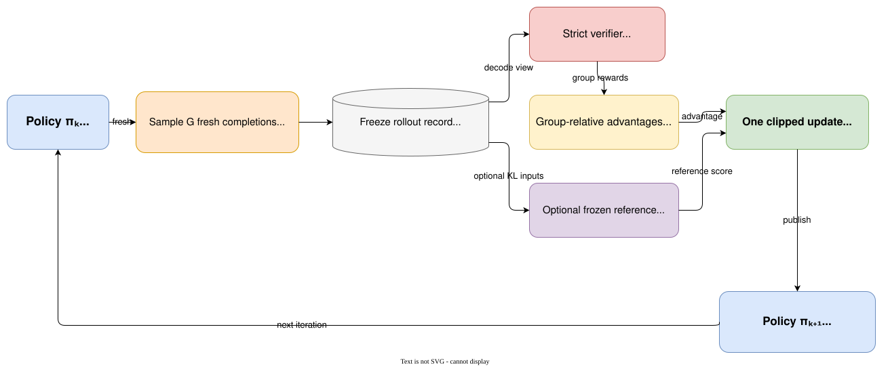

# Synchronous GRPO from stored actions

## Learning objectives

After this chapter, you should be able to:

- follow NanoPT's sample–verify–advantage–update sequence top to bottom;
- align full token coordinates with causal prediction coordinates;
- explain token-mean versus sequence-mean normalization;
- interpret clipping, ratio, degeneracy, and sampled-surprisal metrics;
- state what a zero KL coefficient does and does not mean.

## One deliberately synchronous iteration

NanoPT v0.1 performs:

```text
select prompt batch deterministically
→ sample G fresh completions under policy eval mode
→ save exact IDs and old log probabilities
→ decode only for strict reward
→ compute group-relative advantages
→ optionally score the same IDs with a frozen adapter
→ update the policy once
→ discard the in-memory batch
```

The next iteration samples again from the updated policy. There is no replay buffer and the
reference recipe uses one update epoch, so old log probabilities always identify the immediately
preceding behavior policy.



_The batch boundary is part of the algorithm: exact actions and behavior log probabilities are
frozen before scoring, used for one update, and then discarded before policy $\pi_{k+1}$ samples
again._

## Coordinate shift during collation

For prompt length $P$ and completion length $T$, stored action log probabilities have length $T$.
The full training sequence has length $P+T$. After causal shifting, its prediction coordinates have
length $P+T-1$. The first completion log probability belongs at index $P-1$, because the final
prompt token predicts the first completion token.

[`collate_grpo_completions`](https://github.com/shenli/nanopt/blob/main/src/nanopt/grpo/trainer.py)
constructs that alignment directly from stored token IDs. It pads IDs and masks but never sees the
decoded response.

## Readable clipped update

For each active token, the current/old ratio is

$$
\rho_t = \exp(\log \pi_\theta(a_t\mid s_t) - \log \pi_{\mathrm{old}}(a_t\mid s_t)).
$$

The response advantage is broadcast across its active token positions. The canonical clipped loss
and its sign-specific tests live in `nanopt.core.clipping`; the orchestration remains visible in
[`update_grpo_policy`](https://github.com/shenli/nanopt/blob/main/src/nanopt/grpo/trainer.py).

`token_mean` weights every active token equally, so longer responses have more influence.
`sequence_mean` averages each response first. The reference profile declares `token_mean`; reports
name it explicitly because these objectives differ on unequal lengths.

## Optional frozen-reference scoring

The parent DPO adapter remains loaded and frozen while `grpo` is the only trainable adapter. If
`kl_beta > 0`, NanoPT temporarily selects the parent, scores the exact stored IDs, restores GRPO,
and evaluates the configured direct or nonnegative k3 sampled estimator.

The initial reference profile sets `kl_beta: 0`. This means there is no explicit frozen-reference
KL term. It does **not** mean there is no drift control: clipping, fresh data, one update epoch,
LoRA, a small learning rate, and a short run are local constraints. They are not interchangeable
with KL regularization, and the report states the distinction.

## Metrics worth reading together

- Reward/correctness without degeneracy can show usable on-policy variation.
- A high degenerate fraction explains why many iterations have no learning signal.
- Ratio and clip fraction show how far the update has moved from stored behavior.
- `current_minus_old_logp_mean` is a sampled log-ratio diagnostic, not exact full KL.
- `sampled_action_surprisal = -\log \pi_{\mathrm{old}}(a)` is not full-vocabulary entropy.
- Protocol/EOS/length finish fractions reveal termination changes.
- Protected deterministic evaluation decides whether rollout reward transferred beyond sampled
  training prompts.

## Commands

```bash
uv run nanopt calibrate --mode grpo \
  --tasks artifacts/data/arithmetic_v1/tasks.jsonl \
  --dpo-adapter artifacts/runs/dpo/adapter/dpo \
  --local-files-only --device cuda

uv run nanopt train grpo \
  --tasks artifacts/data/arithmetic_v1/tasks.jsonl \
  --dpo-adapter artifacts/runs/dpo/adapter/dpo \
  --local-files-only --device cuda
```

After training, use the unchanged protected evaluator with the saved GRPO adapter. The pinned GPU
validation passes only if at least one frozen primary target improves and anchor regressions remain
inside the target fixed after pilots.

## What the teaching loop omits

The implementation recomputes full prefixes, samples synchronously, and runs on one GPU. It omits
KV-cache rollout acceleration, distributed generation, weight synchronization, asynchronous
staleness controls, and replay. Those systems change performance and freshness policy; they must
not change stored-action identity or the declared objective.
