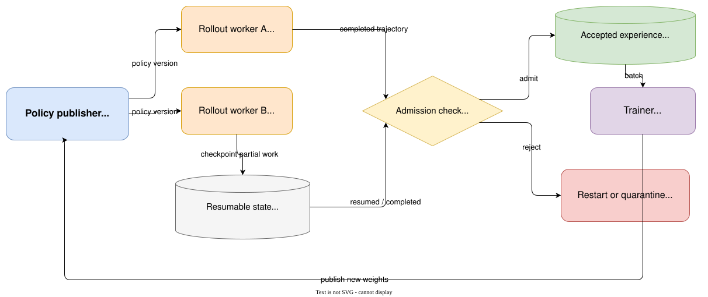

# Rollout infrastructure: long tails, partial work, and staleness

## Learning objectives

After this chapter, you should be able to:

- separate rollout and training workloads;
- explain why variable response lengths create worker idle time and stale data;
- compare finishing stale rollouts with restarting partial work;
- identify which state must survive pause/resume;
- map NanoPT's deterministic simulation to—but not confuse it with—a cluster runtime.

## Two workloads with different shapes

Rollout is autoregressive and latency-sensitive: one token unlocks the next, KV caches grow, and
sequence lengths vary. Training consumes rectangular batches with forward/backward computation and
wants high accelerator utilization. Co-locating them reduces transfer cost but creates memory and
scheduling contention; disaggregating them adds transport and weight-synchronization work.

A shared prompt prefix can reuse KV-cache computation across grouped completions, but each branch
still carries its own continuation state. Pausing a rollout safely requires at least token IDs,
attention position, sampling RNG state, behavior-policy identity, stop state, budgets, and either a
retained KV cache or enough information to rebuild it.

## Long-tail example

Suppose two workers receive lengths `[2, 8, 2, 2]` and the trainer publishes a new policy after each
completion. The long job can finish under an old behavior policy while short jobs drive updates.
Two simple policies expose a tradeoff:

- `finish_stale`: keep useful partial work, but accept version-stale completions;
- `restart_partial`: refresh active jobs, but discard already executed steps.

Run the deterministic systems simulation:

```bash
uv run python labs/15_rollout_scheduler.py
```

[`simulate_rollouts`](https://github.com/shenli/nanopt/blob/main/src/nanopt/systems/rollout_scheduler.py)
advances abstract generation steps and records ticks, policy updates, staleness, and discarded work.
The lab's `finish_stale` case finishes in 8 ticks with one stale completion; `restart_partial` removes
stale completions but takes 14 ticks and discards 6 steps.

## Staleness is semantic, not just elapsed time

NanoPT defines rollout staleness as `finish_policy_version - start_policy_version`. Real systems may
track weight hashes, optimizer steps, or timestamps. A response produced across multiple versions
cannot be treated as if every token came from one behavior policy unless the system records and uses
per-segment behavior probabilities.

Clipping and importance ratios tolerate limited mismatch; they are not permission to ignore policy
identity. Scheduling policy also affects the training distribution because long tasks may be
discarded more often.

## v0.4: pair resumable state with a weight boundary

The v0.4 lab extends the tick scheduler with hash-bound model/world checkpoints, policy
publication, external prefix-cache identity, and admission decisions. Run:

```bash
uv run python labs/22_resumable_rollouts.py
uv run nanopt systems simulate --run-id systems-lab
```

Keeping one policy for the whole episode preserves cache reuse but makes a long episode stale.
Synchronizing only between complete actions makes later actions newer, but invalidates old-policy
KV state and produces a mixed-policy episode. The [systems-perspective tutorial](../tutorials/rl-from-systems-perspective.md)
traces both cases from task snapshot through training admission.



_The admission check separates generation from training. A resumable rollout is useful only when
its tokens, RNG, stop state, budgets, cache identity, and behavior-policy identity remain bound
together._

## Common mistakes

- Measuring average latency while hiding the long tail.
- Calling a paused token list a complete snapshot without RNG/cache/stop state.
- Refreshing weights mid-response and recording only the final version.
- Comparing throughput policies without counting discarded compute.
- Presenting a tick simulation as measured tokens per second.

## Industrial mapping and primary reading

NanoPT omits GPUs, batching, cache memory, networking, backpressure, failures, and real model
generation in this simulation. It isolates the scheduling invariant. Read
[Kimi k1.5](https://arxiv.org/abs/2501.12599) for long-context RL and partial-rollout motivation,
and [HybridFlow/veRL](https://arxiv.org/abs/2409.19256) plus the
[official veRL repository](https://github.com/volcengine/verl) for a distributed system contrast.

## Exercises

1. Change the update interval to two and predict stale/discarded counts.
2. Add a maximum-staleness acceptance rule without silently dropping long tasks.
3. List the state required to resume a sampled response exactly after a process restart.
