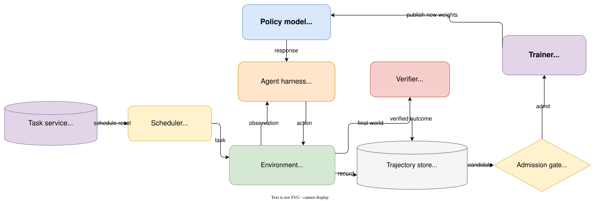

# Reinforcement Learning from a Systems Perspective

> A systems engineer's introduction to reinforcement learning—from state, reward, and policy
> gradients to agent harnesses, verifiers, trajectory stores, and resumable rollouts.

Imagine that a coding agent is asked to fix an expired-session bug.

It runs the tests, searches for the login handler, changes one comparison, runs the tests again,
finds a timezone failure, makes a second edit, and finally passes the hidden test suite. The episode
receives reward `1`.

Where, exactly, did the learning happen?

One answer starts with an algorithm. The model sampled actions from a policy. A verifier produced a
reward. The trainer estimated an advantage, computed token log probabilities, and changed the
weights.

A second answer starts with a system. A scheduler selected a task. A sandbox restored a repository.
A harness constructed observations and parsed tool calls. An event log preserved the sampled token
IDs. A hidden verifier inspected the final workspace. An admission rule decided whether the
trajectory was fresh enough to train on.

Both answers describe the same loop. The first describes its mathematics; the second describes the
machinery that makes the mathematics mean anything.

## Why a systems perspective?

Reinforcement learning is usually introduced through its mathematical abstractions and algorithms:
Markov decision processes, Bellman equations, Monte Carlo estimation, temporal-difference learning,
policy gradients, PPO, and GRPO. These ideas explain how an agent can improve from feedback, but
they deliberately hide most implementation details.

That abstraction is useful until the implementation starts deciding whether the assumptions behind
the equations are true.

An agent policy does not interact with a mathematical environment object. It interacts with a
harness, a sandbox, files, processes, tools, queues, caches, and verifiers. Its trajectory may cross
several services and outlive the policy version that started it. A perfectly implemented loss can
still optimize the wrong behavior if the environment did not reset, hidden tests leaked into the
context, sampled tokens were reconstructed incorrectly, or a stale trajectory was labeled as
on-policy.

Systems engineers often recognize every component in that sentence while still finding the RL
vocabulary difficult to connect. Conversely, an algorithm-first explanation can make PPO or GRPO
look self-contained even though the optimizer is only the final consumer of a much larger
experience-production system.

This perspective closes that gap. It does not replace the mathematics with infrastructure. It asks,
for every mathematical object: where does it live in the running system, which component produces
it, what identity must be preserved, and what failure would make it invalid?

Those questions become especially important for LLM agents. What is the state when the model sees
only a context window? Is the action one token or one tool call? Why can a historical user session
support DPO but not necessarily online PPO? What must be saved when a six-hour rollout pauses? How
can a technically valid cache hit violate the learning objective?

To answer them, we will treat RL as three layers of one system:

```text
decision system:    state → observation → action → transition
learning system:    trajectory → reward → advantage → gradient
experience system:  reset → rollout → verify → admit → update
```

The layers cannot be designed independently. The decision system determines what behavior is
possible. The learning system determines how feedback changes behavior. The experience system
determines which feedback exists and whether it is trustworthy.

The central argument is:

> **An RL algorithm determines how a policy learns from experience. An RL system determines what
> experience the policy can have, what that experience means, and whether it is valid to learn
> from.**

## Where RL appears in real systems

LLM agents are only one example of sequential decision-making. The same structure appears whenever
a controller observes an evolving system, takes an action that changes future conditions, and must
optimize an outcome that may arrive later.

Consider five systems problems:

| System | State or observation | Action | Long-term objective |
| --- | --- | --- | --- |
| Service autoscaler | Request rate, queue depth, latency, replicas, CPU | Add or remove replicas | Meet the latency SLO without wasting capacity |
| Cluster scheduler | Queued jobs, free GPUs, topology, job age | Place, delay, preempt, or migrate a job | Minimize completion time and SLO violations while keeping devices busy |
| Database tuner | Query mix, plans, indexes, cache, storage pressure | Create/drop an index or change a knob | Reduce workload latency without excessive write or storage cost |
| Congestion controller | RTT, loss, acknowledgements, send rate | Increase or reduce the sending rate | Maximize throughput without causing delay or loss |
| Incident-remediation agent | Alerts, logs, topology, recent deploys, runbook state | Inspect, restart, roll back, drain, or escalate | Restore service safely and quickly |

Each problem has delayed consequences. Removing replicas saves money now but may create a queue
thirty seconds later. Preempting a training job frees a GPU but discards work and changes future
queueing. Building an index costs I/O before queries become faster. Increasing a congestion window
improves throughput until a delayed signal reveals that the network is overloaded. Restarting a
service may clear an error while destroying the evidence needed to find the cause.

This is the motivation for RL: the quality of an action depends not only on its immediate result but
on the future states it creates.

It is also a warning not to use RL automatically. If the dynamics are known and a conventional
controller, solver, or queueing policy works, that solution is usually easier to reason about. If
each decision has a correct independent label, supervised learning may be sufficient. RL becomes
interesting when actions alter what happens next, feedback is delayed or sparse, and the system can
produce enough safe, representative interaction to evaluate alternatives.

## Learning goals

By the end, you should be able to translate classical RL terms into concrete agent-system
components; follow a verified outcome back to token-level gradients; distinguish SFT, DPO, PPO, and
GRPO by the experience each method consumes; and reason about reset fidelity, hidden verification,
policy freshness, checkpointing, cache identity, and training admission.

## Part I — The decision system

### RL is the abstraction; the agent stack is an implementation

Classical RL asks a general question: how should an agent act in an environment to maximize
long-term reward?

An LLM agent system asks a concrete version of that question: how should a model generate tokens,
use tools, and change an external world so that an independently measured task succeeds?

The two vocabularies line up like this:

| Classical RL | Coding-agent system |
| --- | --- |
| Agent | Policy model plus the harness that drives it |
| Policy $\pi_\theta$ | Distribution over the next token, response, or tool action |
| State $s_t$ | Task, workspace, processes, budgets, and interaction history |
| Observation $o_t$ | The projection of state placed in the model context |
| Action $a_t$ | A sampled token sequence interpreted as a reply or tool call |
| Environment | Repository, sandbox, tools, tests, and external services |
| Transition | The environment executing an action and changing state |
| Reward $r_t$ | Feedback from tests, rules, judges, costs, or users |
| Trajectory $\tau$ | The state-action-reward history of one attempt |
| Value $V(s)$ | Expected future return from the current state |
| Trainer | The component that turns admitted trajectories into updates |

The mapping is not one-to-one. A single software component may implement several RL concepts, and
one RL concept may span several components.

The harness, for example, builds prompts, describes tools, parses model output, manages memory,
handles retries, and decides when an episode ends. Change the harness and the model visits a
different distribution of observations and actions. The deployed agent is therefore better written
as:

$$
\text{Agent} = \text{Policy model} + \text{Harness}.
$$

This is why a model can appear much stronger under one scaffold than another. Tool names, argument
schemas, context compression, retry logic, and termination rules all shape behavior. They are part
of the decision system, not neutral plumbing.

The word *model* creates another common mismatch. In LLM engineering it usually means the
Transformer. In classical RL, an environment model describes how the world responds:

$$
P(s',r \mid s,a).
$$

A system may use a giant neural policy and still be *model-free* in the RL sense if it does not
learn or plan through an explicit model of environment transitions.

### Follow one coding-agent episode

We will use the same task throughout the article:

> The login endpoint returns HTTP 500 for some expired sessions. Find the bug, fix it, and make the
> test suite pass.

One rollout might look like this:

```text
read task
→ run tests
→ observe three failures
→ search for session-expiry code
→ inspect auth/login.py
→ edit one comparison
→ run tests
→ observe one timezone failure
→ inspect the call path
→ edit timezone handling
→ run tests
→ submit
→ hidden verification passes
```

The policy is the distribution that selects each next action. The harness turns model output into a
structured tool request. The environment executes the request and changes the repository or returns
an observation. The verifier judges the resulting world. The trainer later maps the outcome back to
the exact model-generated tokens.

That last sentence contains most of the difficulty. The final reward arrives after a long chain of
state changes, yet the parameters control token probabilities at each generation step.

### State is not context

In plain next-token generation, it is often convenient to write the state as the original prompt
$x$ plus generated tokens $y_{<t}$:

$$
s_t = (x,y_{<t}), \qquad a_t = y_t.
$$

The transition simply appends the new token. An interactive agent has a larger world. Its complete
state may include:

```text
immutable repository snapshot
current workspace files
running processes
dependency and sandbox versions
public-test results
remaining tool and time budgets
hidden verifier code and data
```

The model sees only an allowed projection:

```text
task description
visible conversation history
tool schemas
selected public tool output
visible remaining budget
```

Formally,

$$
o_t = h(s_t), \qquad o_t \neq s_t.
$$

This makes many agent problems partially observable. The model has to infer enough about the world
from its observation history to choose a useful action.

The observation function $h$ is a systems and product decision. Leak a hidden test into context and
the reward boundary collapses. Omit a build error and the policy acts from an unnecessarily weak
observation. Compress away the task constraint or a failed approach and the model may repeat work
because its represented state no longer contains what the future depends on.

Context management is therefore not just a token-cost optimization. It is state representation.

#### Example: an autoscaler never sees the true instantaneous state

Suppose an autoscaler receives a metrics sample every fifteen seconds. At time $t$, its observation
might be:

```text
p95 latency       180 ms
queue depth       420 requests
request rate      2,800 requests/s
running replicas  18
average CPU       71%
```

The real state is larger. Some new replicas may be starting but not ready. Requests may be unevenly
distributed across availability zones. A deployment may have changed per-request CPU cost. The
metrics themselves describe a window in the recent past.

If the controller adds four replicas, capacity does not appear immediately. During the startup
delay, the next observation may look worse even though the action was appropriate. A policy that
treats the latest metric vector as complete state can incorrectly learn that scaling out increases
latency.

The engineering response is not to declare the Markov property true. It is to design a better state
representation: include pending replicas, recent actions, rollout version, metric age, and a short
history—or use a recurrent policy that can infer hidden conditions. This is the same problem an LLM
agent faces when its context omits a process that is still running.

### One action has two granularities

At the agent level, the policy may choose what looks like one action:

```json
{"tool":"run_tests","arguments":{}}
```

At the Transformer level, that action is a sequence of token decisions. If the prompt contains $P$
tokens, the first sampled action token is predicted at causal coordinate $P-1$. The environment
usually waits for the complete structured action before transitioning, but the trainer applies a
gradient at token coordinates.

Only model-generated tokens should receive policy loss:

```text
system instruction    mask 0
user task             mask 0
tool observation      mask 0
assistant response    mask 1
tool-call tokens      mask 1
```

The high-level tool call explains what changed in the world. The low-level token sequence explains
what probability the model assigned to the behavior. A correct trajectory must preserve both views
and their exact alignment.

This is why decoding a sampled action to JSON and tokenizing it again is unsafe for policy-gradient
training. Whitespace, special tokens, or token segmentation can change. The action executed by the
environment and the action updated by the trainer must be the same sampled token sequence.

### Policy means a probability distribution

A policy is written:

$$
\pi_\theta(a \mid s).
$$

It is the probability of choosing action $a$ in state $s$ under parameters $\theta$. At one point
in the login task, a simplified policy might assign:

| Action | Probability |
| --- | ---: |
| Run the failing tests | 0.50 |
| Search for session code | 0.35 |
| Edit the first matching file immediately | 0.15 |

Greedy decoding selects the largest probability. Sampling draws according to the distribution.
Temperature and top-$p$ reshape the sampling distribution, but the policy remains a conditional
distribution over possible actions.

For an LLM token:

$$
\pi_\theta(y_t \mid x,y_{<t})
$$

is the next-token distribution. Training changes $\theta$, which changes this distribution and thus
the trajectories the system will produce in the future.

RL optimizes expected behavior, not a single lucky run:

$$
J(\theta)
=
\mathbb{E}_{\tau \sim \pi_\theta}[R(\tau)].
$$

The notation $\tau \sim \pi_\theta$ says that the trajectory is sampled by running the current
policy. The same task can produce many different sequences of searches, edits, test runs, and
failures. The objective is to improve their average outcome.

### Reward is local; return carries the future

A reward $R_{t+1}$ is feedback received after one transition. The return $G_t$ is the accumulated
future reward from time $t$:

$$
G_t
=
\sum_{k=0}^{T-t-1}\gamma^k R_{t+k+1}
=
R_{t+1} + \gamma R_{t+2} + \gamma^2 R_{t+3} + \cdots.
$$

The discount factor $\gamma \in [0,1]$ controls how strongly distant rewards count. For finite
agent tasks with only a terminal outcome, $\gamma$ is often close to or equal to one. Efficiency is
frequently represented more explicitly through token, tool-call, time, or risk costs.

That distinction matters because the objective is rarely one-dimensional. A coding-agent reward
might combine correctness, cost, safety, and quality:

$$
r
=
w_1 r_{\text{correctness}}
- w_2 r_{\text{cost}}
- w_3 r_{\text{risk}}
+ w_4 r_{\text{quality}}.
$$

The scalar interface does not make the value judgment simple. It hides it in the definition and
weights. Reward design actively defines what the optimizer will pursue.

Three kinds of signal commonly appear in agent systems. Outcome reward evaluates the final world:
did the hidden tests pass? Process reward evaluates intermediate behavior: did the test count
improve, or did the agent find the relevant file? Costs penalize time, tokens, unsafe operations, or
budget overruns.

Outcome reward is closest to the real objective but sparse. Process reward supplies denser credit
but is easier to game. Cost is necessary for deployability but can make a policy stop too early if
weighted carelessly. A common pattern is a correctness gate: style and efficiency can improve a
score only after the outcome is valid.

#### Example: a database index has an immediate cost and a delayed return

Imagine a database tuning policy that considers adding an index. Building it consumes CPU and I/O,
temporarily slows writes, and occupies storage. Those are immediate negative rewards. The benefit
arrives later when a recurring analytical query becomes faster.

A one-step objective might always reject the index because the build interval looks bad. A return
captures the longer horizon:

```text
index build cost
+ future query-latency reduction
+ future CPU reduction
- ongoing write amplification
- storage cost
```

The discount factor encodes how much future workload benefit matters relative to the current
disruption. The episode boundary matters too. Measure only the first minute and the index looks
harmful; measure a week and a temporary benefit may be overvalued after the query mix changes.

This is why reward design and evaluation windows are part of the system specification. The formula
cannot recover costs or benefits that the telemetry pipeline never records.

### Value is a forecast attached to state

The state value under policy $\pi$ is the expected future return from state $s$:

$$
V_\pi(s)
=
\mathbb{E}_\pi[G_t \mid S_t=s].
$$

The action value additionally fixes the next action:

$$
Q_\pi(s,a)
=
\mathbb{E}_\pi[G_t \mid S_t=s,A_t=a].
$$

For the login task, $V_\pi(s)$ asks: given the current repository, test results, context, and
budgets, how likely is this agent to finish well? $Q_\pi(s,a)$ asks: if it first runs the tests—or
instead edits immediately—what return should we expect?

The advantage compares one action with the policy's normal expectation in that state:

$$
A_\pi(s,a) = Q_\pi(s,a) - V_\pi(s).
$$

A successful outcome can still contain a negative-advantage detour. A failed outcome can contain a
good early action followed by a later mistake. Advantage is an attempt to distinguish “good result”
from “better than expected decision.”

### Bellman equations describe an interface boundary

Return has a recursive form:

$$
G_t = R_{t+1} + \gamma G_{t+1}.
$$

Taking a conditional expectation gives the Bellman expectation equation:

$$
V_\pi(s)
=
\mathbb{E}_\pi
\left[
R_{t+1} + \gamma V_\pi(S_{t+1})
\mid S_t=s
\right].
$$

For a systems engineer, its meaning is direct: the value of the current state decomposes into the
reward produced by the next transition plus the discounted value of the state returned by the
environment.

The equation crosses an interface boundary. The policy chooses an action; the environment produces
a transition; the value estimator predicts what remains. If state serialization omits information
needed to predict the future, the abstraction is broken before the algorithm begins.

This recursive structure does not mean ordinary Transformer decoding is dynamic programming.
Autoregressive decoding samples from a policy. Dynamic programming assumes known transition
dynamics and repeatedly evaluates or improves values across a state space. The recursion looks
similar; the computational problem is different.

#### Example: the value of leaving one GPU idle

A cluster scheduler sees one free GPU and two queued jobs. A short low-priority job can start now; a
large distributed job will become runnable when another GPU is released in five minutes.

A greedy utilization metric starts the short job immediately. A value-aware scheduler can assign a
higher value to the state in which one GPU remains idle briefly, because that state enables the
distributed job to start sooner and may reduce total weighted completion time.

The Bellman decomposition makes the trade-off explicit:

```text
value of current placement
= immediate utilization or queue cost
+ expected value of the resulting future cluster state
```

Whether waiting is correct depends on arrival uncertainty, preemption cost, job priorities, and the
accuracy of runtime estimates. The example shows why “keep every GPU busy now” is a metric, not
necessarily the long-term objective.

### Monte Carlo and temporal difference are two update schedules

Without an environment model, the most literal estimate is to run an episode to completion and use
the observed return. If three visits to a state lead to returns 10, 4, and 7, a Monte Carlo estimate
is:

$$
V_\pi(s) \approx \frac{10+4+7}{3} = 7.
$$

An incremental update is:

$$
V(S_t)
\leftarrow
V(S_t) + \alpha\left[G_t - V(S_t)\right].
$$

The target comes from a completed real outcome. This avoids bootstrapping from the value model's own
guess, but it requires waiting for termination and can have high variance. A network timeout at the
end of an hour-long episode can change the signal assigned to much earlier actions.

Temporal-difference learning updates after a transition using the next state's current estimate:

$$
\delta_t
=
R_{t+1} + \gamma V(S_{t+1}) - V(S_t).
$$

It receives feedback earlier and often with lower variance, but its target includes
$V(S_{t+1})$. Errors in that estimate can propagate backward. In systems language, Monte Carlo
waits for the completed transaction; TD consumes an intermediate result plus a forecast.

SARSA and Q-learning illustrate a separate choice. SARSA uses the next action actually selected by
the behavior policy:

$$
Q(S_t,A_t)
\leftarrow
Q(S_t,A_t)
+ \alpha
\left[
R_{t+1} + \gamma Q(S_{t+1},A_{t+1}) - Q(S_t,A_t)
\right].
$$

Q-learning uses the best currently estimated next action:

$$
Q(S_t,A_t)
\leftarrow
Q(S_t,A_t)
+ \alpha
\left[
R_{t+1} + \gamma \max_{a'}Q(S_{t+1},a') - Q(S_t,A_t)
\right].
$$

SARSA evaluates continuation under the policy's actual behavior, including exploration. Q-learning
targets a greedy continuation even when another behavior collected the transition. That is the
classic distinction between on-policy and off-policy control.

In an operations setting, a Monte Carlo target could wait until a batch job finishes and use its
complete completion-time and cost outcome. A TD target could update the scheduler after each stage,
using the observed stage duration plus an estimate of the remaining job value. The first is delayed
but grounded in a completed run; the second reacts sooner but can inherit error from a poor runtime
predictor.

Exploration is unavoidable because the largest current $Q$ is only the best estimate among actions
the system has tried. A policy that never explores cannot discover an unknown better path. A policy
that only explores cannot reliably earn reward. In LLM systems, sampling temperature, task
diversity, rollout count, and action-space design all affect this balance.

Production exploration also has a safety boundary. Randomly removing half the replicas, dropping a
database index, or increasing a sending rate without constraints may teach the controller something
at an unacceptable cost. Real systems use simulation, replay, shadow decisions, conservative action
bounds, canaries, and explicit fallback controllers to move exploration away from irreversible
failure. “Online” does not have to mean “unconstrained experiments on users.”

### RL classifications answer different systems questions

Terms such as value-based, policy-based, model-free, on-policy, and online are not competing labels
on one axis. They answer different questions:

| Question | Common choices |
| --- | --- |
| What is learned directly? | Value, policy, or both in actor-critic |
| Is transition behavior modeled explicitly? | Model-based or model-free |
| Who generated the training data? | On-policy or off-policy |
| How is future return estimated? | Monte Carlo or temporal difference |
| Can the policy keep interacting? | Online or offline RL |

Q-learning is commonly value-based, model-free, off-policy, and TD. REINFORCE is policy-based,
model-free, on-policy, and Monte Carlo. PPO is usually model-free, actor-critic, and on-policy or
near-on-policy. GRPO is policy optimization without a separate learned critic.

The classifications become easier to remember when each is tied to a system boundary: what the
trainer stores, which service generates data, whether the world can be queried again, and whether
an estimator waits for termination.

## Part II — The learning system

The decision system produces a trajectory:

$$
\tau = (s_0,a_0,r_1,s_1,a_1,r_2,\ldots,s_T).
$$

The learning system has to convert that execution history into changes in token probability. This
is where sparse outcomes, long horizons, and behavior-policy identity become optimization problems.

### Credit assignment is the central difficulty

Suppose the coding agent eventually succeeds after this path:

```text
run tests
→ open the right file
→ open an irrelevant file
→ make a wrong edit
→ revert
→ identify the timezone issue
→ make the correct edit
→ pass hidden tests
```

The final reward does not imply that every action was good. Nor does a failed episode imply that
every earlier action was bad. RL does not receive the clean token targets available in supervised
learning. It observes statistical relationships between decisions and later outcomes.

Value estimates, baselines, process rewards, and multiple rollouts are all mechanisms for improving
that attribution. None can perfectly identify causality from a single execution trace.

### Log probability connects behavior to parameters

For a generated sequence, probability is a product of conditional token probabilities. Logarithms
turn that product into a sum:

$$
\log \pi_\theta(y \mid x)
=
\sum_{t=1}^{T}
\log \pi_\theta(y_t \mid x,y_{<t}).
$$

The gradient $\nabla_\theta \log \pi_\theta(a_t \mid s_t)$ points in the parameter direction that
increases the sampled action's log probability. A policy-gradient estimator weights that direction
by return or advantage:

$$
\nabla_\theta J(\theta)
\approx
\mathbb{E}
\left[
\sum_t
\hat A_t
\nabla_\theta
\log \pi_\theta(a_t \mid s_t)
\right].
$$

Positive advantage makes an action more likely. Negative advantage makes it less likely. Near-zero
advantage produces little update.

REINFORCE uses complete sampled returns:

$$
\nabla_\theta J(\theta)
\approx
\mathbb{E}
\left[
\sum_t
G_t
\nabla_\theta
\log \pi_\theta(a_t \mid s_t)
\right].
$$

It is conceptually clean and requires no learned environment model or critic. Its weakness is high
variance: the same early action can receive very different returns because of later sampling,
service failures, or environment noise.

### A baseline reduces variance without changing the target direction

Subtracting a baseline that depends on state but not the sampled action gives:

$$
\hat A_t = G_t - b(s_t).
$$

The usual choice is a learned value estimate $V_\phi(s_t)$. The baseline asks not whether the final
reward was absolutely high, but whether it was high relative to what was expected from that state.

This does not bias the expected policy-gradient direction because:

$$
\mathbb{E}_{a \sim \pi_\theta(\cdot \mid s)}
\left[
\nabla_\theta \log \pi_\theta(a \mid s)
\right]
= 0.
$$

Actor-critic makes the split explicit. The actor $\pi_\theta(a \mid s)$ chooses actions. The critic
$V_\phi(s)$ estimates future return. The critic lowers variance but adds another model, loss,
forward path, optimizer state, and source of estimation error.

Generalized Advantage Estimation interpolates between short TD targets and full Monte Carlo
returns:

$$
\hat A_t^{\mathrm{GAE}(\gamma,\lambda)}
=
\sum_{l=0}^{T-t-1}
(\gamma\lambda)^l\delta_{t+l},
$$

where:

$$
\delta_t = r_t + \gamma V_\phi(s_{t+1}) - V_\phi(s_t).
$$

Smaller $\lambda$ trusts shorter bootstrapped estimates; $\lambda$ near one moves toward complete
returns. From a systems perspective, it tunes how much the trainer trusts its forecasting service
versus delayed observed outcomes.

### Policy gradient looks like weighted SFT—but the data contract is different

Supervised fine-tuning minimizes negative log probability on demonstrated target tokens:

$$
L_{\mathrm{SFT}}(\theta)
=
-\sum_t m_t
\log \pi_\theta(y_t \mid x,y_{<t}).
$$

The mask $m_t$ selects model-generated target positions. Every selected demonstration token is
treated as behavior to imitate.

A sampled policy-gradient loss can be written:

$$
L_{\mathrm{PG}}(\theta)
=
-\sum_t m_t
\hat A_t
\log \pi_\theta(a_t \mid s_t).
$$

The final tensor operation resembles weighted SFT. The origin of the tokens and weights is what
changes everything. SFT consumes curated targets. Online RL consumes actions sampled by a behavior
policy in an executable environment, then weights them using measured consequences.

That is why an RL implementation needs exact online token IDs, behavior log probabilities, policy
versions, and environment lineage. Adding a `reward` column to an arbitrary text dataset does not
create on-policy experience.

### PPO constrains reuse near the behavior policy

PPO typically generates a rollout batch with an old policy and then performs several updates on that
batch. It records the old log probability and computes the probability ratio:

$$
\rho_t(\theta)
=
\frac{\pi_\theta(a_t \mid s_t)}
{\pi_{\theta_{\mathrm{old}}}(a_t \mid s_t)}
=
\exp\left(
\log \pi_\theta(a_t \mid s_t)
-
\log \pi_{\theta_{\mathrm{old}}}(a_t \mid s_t)
\right).
$$

A ratio of one means the current and behavior policies assign the same probability to the recorded
action. PPO's clipped objective is:

$$
L^{\mathrm{CLIP}}(\theta)
=
\mathbb{E}_t
\left[
\min\left(
\rho_t(\theta)\hat A_t,
\operatorname{clip}(\rho_t(\theta),1-\epsilon,1+\epsilon)\hat A_t
\right)
\right].
$$

For positive advantage, increasing the ratio beyond $1+\epsilon$ stops improving the clipped
objective. For negative advantage, the symmetric boundary limits a large probability decrease.
The batch indicates a direction, but the optimizer is discouraged from rewriting behavior too far
from the policy that collected it.

A practical PPO cycle is a distributed dataflow, not just a loss:

```text
sample tasks
→ generate rollouts with current policy
→ store exact IDs, masks, and old log probabilities
→ compute verifier or reward-model scores
→ predict values
→ compute returns and advantages
→ update policy and critic
→ evaluate and publish a new policy
```

The implementation must coordinate policy inference, a reference model or KL calculation, reward,
value inference, training, and checkpoint publication. Clipping does not make unidentified or
arbitrarily stale data safe; it controls movement around a known behavior policy.

### DPO changes the learning interface

DPO consumes a fixed preference pair for prompt $x$: a chosen response $y_w$ and a rejected response
$y_l$. A typical objective is:

$$
L_{\mathrm{DPO}}(\theta)
=
-\mathbb{E}
\left[
\log \sigma
\left(
\beta
\left[
\log\frac{\pi_\theta(y_w\mid x)}{\pi_{\mathrm{ref}}(y_w\mid x)}
-
\log\frac{\pi_\theta(y_l\mid x)}{\pi_{\mathrm{ref}}(y_l\mid x)}
\right]
\right)
\right].
$$

It requires no online environment, learned reward model, or critic during the update. This makes it
possible to learn from an accepted patch and a rejected patch even when the original repository can
no longer be executed.

The limitation follows from the same interface. DPO learns which supplied response is preferred. It
does not naturally try a new action, observe a new transition, or explore outside the pair. An
iterative system can use the current policy to generate new candidates and construct fresh pairs,
but the unit consumed by the DPO loss remains a comparison, not a scalar-reward trajectory.

### GRPO trades the critic for grouped rollouts

Verifiable reasoning and coding tasks often produce a more natural record: sample several attempts
for the same task and score each one. GRPO standardizes rewards within a group:

$$
\hat A_i
=
\frac{
r_i - \operatorname{mean}(r_1,\ldots,r_G)
}{
\operatorname{std}(r_1,\ldots,r_G)+\varepsilon
}.
$$

Attempts above the group mean receive positive advantage; those below it receive negative
advantage. This removes the separate critic, exchanging value-model cost for more rollouts per task.

It does not remove the hard parts of RL. If every attempt is wrong or every attempt is correct, the
group has little or no relative signal. A successful completion can still contain bad intermediate
steps. The best result in a terrible group can have positive relative advantage. Absolute reward,
task difficulty, sampling diversity, and held-out evaluation remain necessary.

For a multi-turn agent, the system must also decide how an episode-level advantage reaches action
tokens. NanoPT's small Agent RL path assigns it to every sampled action token and reports a
terminal-action-only counterfactual. In the accepted run, all-action credit covered 3,649 tokens;
terminal-only credit covered 340, or 9.32%. The comparison does not declare one rule universally
correct. It exposes what earlier behavior each rule can or cannot reinforce.

### The algorithms differ by the experience they consume

The most useful comparison is not “which loss is newer?” but “what data contract does the trainer
require?”

| Method | Training unit | Signal | Needs current-policy interaction? | Learned critic? |
| --- | --- | --- | ---: | ---: |
| SFT | Prompt and demonstration | Target tokens | No | No |
| DPO | Chosen/rejected pair | Relative preference | Usually no | No |
| PPO | Behavior-policy trajectory | Reward plus value-based advantage | Yes or nearly so | Usually |
| GRPO | Group of behavior-policy trajectories | Relative verified reward | Yes or nearly so | No |
| On-policy distillation | Student rollout plus teacher distribution | Dense teacher guidance | Student rollout required | No |

On-policy distillation illustrates another point. A teacher can score tokens on prefixes the
student actually visits, rather than supplying only fixed demonstrations. The student encounters
its own mistakes and the teacher provides dense guidance there. The learning signal is not an
environment return in the ordinary sense, but the experience distribution is still generated by
the current student.

All these methods change token probabilities. They differ in who generated the tokens, what the
feedback represents, whether the world can be entered again, and how far the updated policy may
move from the data-producing policy.

### One production incident, four learning interfaces

Suppose an operations agent responds to a latency incident caused by a bad deployment. An expert
eventually inspects the rollout, compares error rates by version, rolls back the service, verifies
recovery, and records the incident.

The same event becomes different training data depending on the learning method.

**For SFT**, the team turns the expert response into a demonstration:

```text
observation: latency rose immediately after deployment build 842
target action: compare build 842 with the previous version
target action: roll back build 842
target action: verify latency and error-rate recovery
```

The trainer imitates the selected actions. It does not need to rerun the incident, but it also does
not learn what would have happened after a different action.

**For DPO**, the team constructs a preference pair from the same starting context:

```text
chosen:  inspect version metrics → roll back → verify
rejected: restart every replica → declare success without verification
```

The preference explains which response is better. The environment can remain offline, but the
quality of the lesson depends on whether the pair differs for the intended reason rather than style
or verbosity.

**For PPO**, the current policy must enter a resettable incident environment, choose actions, and
receive an outcome. The trajectory needs old log probabilities and value estimates; the verifier
might combine recovery, time-to-mitigation, unsafe-operation penalties, and final health. After the
policy changes, new rollouts are needed to keep the loop near on-policy.

**For GRPO**, several independent copies of the same incident start from the same snapshot. One
attempt rolls back safely, one restarts the wrong service, one identifies the deploy but never
verifies recovery, and one exhausts its tool budget. Their verified outcomes provide group-relative
advantages without a learned critic.

This example is useful because the task description is identical in all four cases. What changes is
the experience contract: demonstration, comparison, actor-critic trajectory, or grouped verified
rollouts.

### Published systems show the techniques in context

The most useful lesson from modern post-training reports is not that one algorithm won. It is how
algorithm, data, verification, evaluation, and infrastructure were assembled into a working system.

#### Tülu 3: SFT, DPO, and RLVR solve different stages

[Tülu 3](https://arxiv.org/abs/2411.15124) presents a deliberately open post-training pipeline. Its
recipe combines supervised fine-tuning, preference tuning with DPO, and Reinforcement Learning with
Verifiable Rewards (RLVR). The stages are not interchangeable:

```text
curated instruction demonstrations
→ SFT for broad instruction-following behavior
→ preference data and DPO for response preferences
→ verifiable tasks and RLVR for skills with checkable outcomes
```

For RLVR, a verification function replaces a learned reward model on tasks whose outcomes can be
checked, including mathematical reasoning and constrained instruction following. The project also
separates development and unseen evaluations and treats data decontamination as part of the recipe.

For a systems engineer, this is a dataflow example. Each stage has a different input schema,
feedback producer, and failure mode. A high-quality SFT corpus cannot substitute for fresh RLVR
rollouts; a verifier cannot teach broad conversational behavior that its checks do not describe;
and a training improvement is not convincing without held-out evaluation.

#### DeepSeekMath and DeepSeek-R1: verifiability enables scale, but reward is not the whole product

[DeepSeekMath](https://arxiv.org/abs/2402.03300) introduced GRPO while training mathematical
reasoning. Multiple responses to the same problem can be compared using outcome rewards, allowing
group-relative baselines without a separate critic. Mathematics is attractive because many final
answers are automatically checkable and repeated sampling can expose both successful and failed
reasoning paths.

[DeepSeek-R1](https://arxiv.org/abs/2501.12948) provides an important counterexample to the idea that
RL alone solves the entire product. DeepSeek-R1-Zero applied large-scale RL without preliminary SFT
and developed strong reasoning behavior, but the report also describes poor readability and language
mixing. DeepSeek-R1 added cold-start data and a multi-stage training pipeline to improve the final
behavior.

The systems lesson is that a scalar correctness reward defines only part of the desired interface.
It may strongly improve solution discovery while leaving presentation, language consistency,
safety, or general helpfulness underspecified. SFT, preference data, reward rules, and evaluation
cover different dimensions of the product contract.

The example also makes reward hacking concrete. A math verifier that compares only a short final
answer may reward guessing, malformed reasoning with a lucky result, or parser exploits. The
environment needs canonical answer parsing, adversarial tests, and a task distribution that makes
random success unlikely.

#### Kimi k1.5 and Kimi K3: longer reasoning changes the runtime

[Kimi k1.5](https://arxiv.org/abs/2501.12599) treats long context as a scaling dimension for RL. Its
report describes 128K-context reinforcement learning, prompt filtering for diverse and objectively
evaluable tasks, generated test cases for coding rewards, and partial rollouts that reuse large
prefixes of unfinished trajectories rather than regenerating them from the beginning.

This makes several abstract concepts operational. The prompt sampler controls curriculum and reward
variance. Test-case generation becomes part of the reward service. Long responses create stragglers.
Partial reuse raises policy-age questions. Length penalties trade reasoning budget against training
and inference cost.

[Kimi K3](https://huggingface.co/papers/2607.24653) reports the same pressure at agent scale:
million-token agentic RL with persistent rollout and sandbox state. At that horizon, conversation
tokens alone cannot represent a resumable episode. Model execution state, external world state,
cache state, and sandbox lifecycle become part of the RL implementation.

NanoPT does not reproduce these large-scale systems or their performance. Its local resumable-
rollout lab extracts a few invariants—model/world checkpoint pairing, policy-keyed cache identity,
weight-sync boundaries, and admission—so they can be inspected without a cluster.

### On-policy experience is perishable

Let $\mu$ be the behavior policy that generated a trajectory and $\pi_\theta$ the policy being
optimized. If they match—or remain close under a declared rule—the data is on-policy or
near-on-policy. As training publishes new weights, the relationship decays.

This explains why old user trajectories cannot usually be fed directly into standard PPO. They may
lack exact behavior log probabilities. More fundamentally, a new policy cannot revisit the original
world to try a different action and receive a comparable reward. The records remain useful for SFT,
DPO, reward-model training, failure analysis, and task mining, but they are behavioral data rather
than renewable online experience.

Offline RL tries to learn a better policy from a fixed trajectory collection. Its central risk is
distribution shift: a value estimator may assign high value to actions rarely or never represented
in the dataset, and there is no environment available to falsify that prediction. The action space
of an LLM agent—arbitrary tokens, tool parameters, and file edits—makes this especially difficult.

The practical lesson is not that historical data lacks value. It is that different uses require
different evidence. A transcript suitable for failure mining is not automatically valid for a
probability-ratio objective.

## Part III — The experience system

The learning equations assume that states, actions, rewards, and behavior policies mean what their
records say. The experience system exists to make those assumptions true at scale.



_The trainer is downstream of an admission boundary, not directly downstream of model text. A
trajectory becomes training experience only after its world transition, outcome, and behavior
identity have been retained and checked._

The model proposes an action. The harness makes it executable. The environment performs a real
transition. The verifier measures the world. The trajectory store preserves identity and lineage.
The admission layer determines whether the trainer may consume the result.

### A training task is a resettable world, not a prompt

To compare repeated attempts, each rollout must begin from a semantically identical initial state:

```text
snapshot H
├── reset → rollout A workspace
├── reset → rollout B workspace
├── reset → rollout C workspace
└── reset → rollout D workspace
```

If rollout B inherits rollout A's edit, their rewards no longer isolate policy behavior. A
group-relative advantage would treat an environment difference as an action-quality difference.

A complete task contract looks more like:

$$
\text{Task}
=
(
\text{initial state},
\text{objective},
\text{action space},
\text{budget},
\text{termination},
\text{verifier}
).
$$

For the login bug, this might mean a pinned commit and container image; permission to read, search,
edit, and run tests; a forty-call budget; termination on submission, timeout, or budget exhaustion;
and a verifier that operates in a separate workspace.

Repeatability does not mean every rollout takes the same path. It means different paths start from
the same world and can be judged by the same contract.

### The verifier judges world state, not self-report

An agent can always say, “The bug is fixed and every test passes.” The statement is not evidence.
For a coding task, an independent verifier may check the build, public and hidden tests,
forbidden-file modifications, hard-coded outputs, security properties, and diff boundaries.

Public verification gives the agent feedback during an episode. Hidden verification checks held-out
behavior after termination. The split supports iteration without fully exposing the objective,
provided hidden code, workspaces, and detailed failures never become policy observations.

Reward hacking is not an exception to optimization; it is optimization against an incomplete
specification. Reward public-test success and a capable policy may rewrite the tests. Reward citation
count and it may generate irrelevant references. Penalize every tool call and it may stop before
verifying the fix.

The response is to improve the world and measurement contract: correctness gates, hidden checks,
anti-cheating rules, independent artifacts, fixed evaluation, and retained failure examples. A
higher training reward alone does not prove improved capability.

### Task distribution is part of the objective

RL can only improve behavior in worlds the system allows the policy to experience. If every coding
task is a small Python repository with one obvious failing test, the policy may learn a narrow loop:
search the function name, edit one line, run tests. A better optimizer will optimize that narrow
distribution more thoroughly; it will not create missing experience.

A useful task portfolio combines stable anchor tasks, held-out tasks, synthetic tasks, reconstructed
real failure modes, and frontier tasks near the current capability boundary. Difficulty matters for
GRPO in particular: groups that are always all-correct or all-wrong provide little relative signal.

Task synthesis turns dataset construction into an evolving service. As the policy improves, the
service must find richer but still verifiable worlds. Harness diversity serves a related purpose:
varying tool schemas, prompts, memory policies, and context management helps distinguish general
agent behavior from memorization of one scaffold.

These choices are curriculum design expressed as infrastructure.

### A trajectory store is not a chat-log bucket

A readable transcript is valuable for humans, but a training-quality trajectory may also require:

```text
task and immutable snapshot identity
environment and harness versions
exact prompt and sampled token IDs
current-action masks
sampling configuration
behavior-policy version and weight hash
FP32 behavior log probabilities
tool requests and state transitions
checkpoint, pause, and resume events
termination reason
verifier evidence and reward breakdown
privacy, safety, and admission labels
```

The store has to associate asynchronous verifier results with the right execution, preserve partial
and resumed trajectories, enforce data-age rules, and trace a final reward back to every action.
This is closer to an event-sourced execution database than a collection of JSONL conversations.

Lineage is not bureaucracy. Without it, a trainer can silently mix task snapshots, reward versions,
or policy weights and still produce plausible-looking loss curves.

### Long-horizon agents turn latency into a learning problem

Synchronous RL often follows this rhythm:

```text
generate a rollout batch
→ wait for every rollout
→ compute rewards and advantages
→ update the policy
```

Agent durations have a long tail. One task ends in seconds; another runs for an hour. Waiting for
the slowest trajectory leaves rollout and training resources idle. Dropping it wastes the hardest
experience and biases the curriculum toward short tasks.

Partial rollout systems begin optimization after enough trajectories finish, pause unfinished work,
and resume it in a later iteration. The optimization improves utilization but creates a policy-age
problem: the first half of a long trajectory may have been sampled by weights several updates older
than the final half.

Scheduling policy now affects both throughput and statistics.

### A resumable rollout checkpoint has two halves

Saving conversation text is insufficient. A valid checkpoint pairs model execution state with world
execution state:

```text
partial rollout checkpoint
├── model state
│   ├── exact prompt token IDs
│   ├── sampling RNG state or counter
│   ├── parser and safe-stop state
│   ├── behavior-policy version and hash
│   ├── generation configuration
│   └── prefix-cache identity
└── world state
    ├── immutable task snapshot
    ├── current workspace or sandbox snapshot
    ├── event cursor
    └── remaining budgets
```

Restore only the model half and its context may describe files that do not exist. Restore only the
world half and the model may need to prefill a huge history—or continue from the wrong token or RNG
position. Both halves must represent the same action boundary.

NanoPT's teaching implementation pauses only between complete tool actions. Mid-generation pause
would additionally require exact decoder, tokenizer, parser, and sampling state. An incomplete JSON
tool call must never be exposed to the environment as if it were a complete action.

Hash-binding makes silent mismatch explicit. Resume can reject a changed task snapshot, inconsistent
model and world cursors, invalid remaining budget, unexpected workspace state, or a modified payload
with an old hash.

This resembles distributed transaction recovery because it is one: the trajectory spans a model
runtime and a mutable external world.

### Weight synchronization has no free answer

Suppose a rollout pauses under policy v0 and the trainer publishes v1. The worker has two defensible
choices.

It can keep v0 until the episode ends. The episode has one behavior-policy identity, stored
probabilities remain coherent, and the v0 prefix cache is reusable. The cost is staleness and the
need to retain or reload old weights.

Or it can switch to v1 between actions. Later decisions use newer weights and no tool call is split
across versions. The cost is a mixed-policy episode, invalid old-policy KV state, and the need for
per-action or per-segment off-policy semantics before training.

Changing weights in the middle of an action while recording only the final version is not a third
solution. It destroys the identity of the behavior that produced the sampled tokens.

The trade-off is among utilization, freshness, cache reuse, and objective validity. A scheduler can
make the rule explicit; it cannot make the trade-off disappear.

### Cache identity includes policy weights

For a Transformer prefix $x_{1:P}$, KV state depends on tokens and parameters:

$$
K = f_\theta(x_{1:P}).
$$

The same tokens under v0 and v1 generally produce different keys and values. A correct external
cache identity must include both:

```text
cache key = hash(policy weights, exact prompt token IDs)
```

Keying only by tokens can return numerically invalid state after a weight update. A friendly version
label is also insufficient unless it is immutably bound to the actual weights.

For long-context agents, cache invalidation can mean recomputing hundreds of thousands of prefix
tokens. Partial rollouts concentrate resumptions near iteration boundaries, creating bursts of
prefill. Cache placement, eviction, and prefetch therefore influence which trajectories the system
can afford to finish—and indirectly the training distribution.

### Collection and admission are separate decisions

A completed trajectory is evidence. It is not automatically a training sample.

For trainer version $v$, define the lag of action $j$ as:

$$
\ell_j = v - v_j^{\text{behavior}}.
$$

An admission service can inspect each action's behavior version, whether the episode mixes versions,
maximum lag, snapshot consistency, verifier validity, termination status, and privacy or safety
labels. It records an accept or reject decision with a reason.


_Generation throughput is upstream of the decision that matters to learning: whether a complete,
policy-identified trajectory satisfies the trainer's current admission contract._

This separation preserves expensive trajectories for analysis, debugging, SFT mining, or future
research without pretending that every record satisfies the current optimizer's assumptions.

It also prevents a subtle organizational failure: the rollout team reports a large volume of
collected tokens, and the training team assumes the tokens are usable. Experience throughput should
be measured after verification and admission, not only after generation.

### The scheduler changes the data distribution

An online scheduler is not statistically neutral.

Prefer short tasks and easy work dominates batches. Drop every straggler and the policy rarely
learns from long-horizon failures. Resume only trajectories with cheap cache restoration and cache
locality becomes an implicit curriculum. Under-provision one environment type and that task family
contributes fewer updates.

Throughput, task mix, policy lag, completion rate, reward variance, verifier yield, and admission
rate belong on the same dashboard. A systems optimization is incomplete until its effect on learned
experience is measured.

The same reasoning informs architecture. Co-located systems alternate rollout and training on the
same accelerators, reducing weight-transfer distance but forcing memory and execution modes to swap.
Disaggregated systems scale rollout and training independently, but must synchronize weights and
manage stale workers. Placement determines not only performance but how quickly experience ages.

### User data should guide task reconstruction

Authorized production data can reveal task distributions, failure patterns, tool usage, latency,
cost, user edits, accepted patches, reopened work, and safety incidents. These signals are valuable
even when the original world cannot be retained.

Without that world, however, a new policy cannot take a different action and observe the result.
The practical flywheel is therefore not:

```text
user transcript → PPO
```

It is:

```text
authorized production signals
→ privacy review and failure mining
→ reconstruct the task in an open, internal, mock, or otherwise authorized environment
→ build public and hidden verification
→ collect fresh rollouts from the current policy
→ admit valid experience
→ train and evaluate
→ deploy gradually and observe new failures
```

The original session says what should be taught. The reconstructed environment makes repeated
learning possible.

Open-source repositories are especially useful for coding-agent research because commits can be
pinned, dependencies restored, workspaces copied, tests executed, and held-out checks added. Mock
applications serve a similar role for email, CRM, browser, and knowledge-work tasks: they preserve
important state transitions while making reset and verification possible.

Neither is the full production world. The gap has to be narrowed continuously using real failure
patterns, without moving private data or irreversible side effects into the training loop.

### Evaluation and deployment close a different loop

Rising training reward does not prove general capability. The policy may overfit the task generator,
harness, public verifier, or reward model.

A credible evaluation stack separates:

```text
training tasks
→ fixed held-out tasks
→ dynamic hidden tasks
→ out-of-distribution tasks and harnesses
→ safety and cost regressions
→ human trajectory review
```

Promotion from checkpoint to production should remain staged: fixed evaluation, hidden evaluation,
safety review, shadow traffic, canary deployment, monitored rollout, and a tested rollback path.

Agent policies can modify external state, so tail risk matters alongside average reward. A checkpoint
with a slightly higher completion rate may still be worse if it increases destructive actions,
permission errors, extreme cost, or unreliable self-verification.

## Worked example — a latency-aware autoscaler

To connect the three layers without an LLM, consider a team replacing a threshold autoscaler for a
latency-sensitive API. The existing rule adds replicas when average CPU exceeds 70%. It reacts late
to bursty traffic, but the team cannot safely let an untested policy explore arbitrary capacity
changes in production.

### Decision layer

The team first defines a decision every fifteen seconds. Its observation is:

```text
request rate over 15 s
queue depth
p50 / p95 / p99 latency
error rate
running, pending, and draining replicas
CPU and memory by replica
time since the last scaling action
deployment and traffic-profile identifiers
```

The action is a bounded replica delta:

```text
{-2, -1, 0, +1, +2}
```

The environment is not Kubernetes alone. It includes the workload generator, service binary,
startup delay, load balancer, cluster capacity, metrics delay, and failure injection. Together those
components determine the transition from one observation window to the next.

The action boundary matters. “Add two replicas” is requested at $t$, acknowledged by the control
plane later, and becomes effective only after images load, health checks pass, and the load balancer
routes traffic. Recording the desired count without lifecycle events would make the next state look
inconsistent.

### Learning layer

The team defines a per-window reward with a hard availability gate:

$$
r_t
=
-w_L \max(0,\operatorname{p99}_t-\operatorname{SLO})
-w_E \operatorname{error\_rate}_t
-w_C \operatorname{replicas}_t
-w_H |\Delta\operatorname{replicas}_t|.
$$

The terms penalize latency above the SLO, errors, capacity cost, and scaling churn. A severe
availability violation terminates the simulated episode and applies an additional penalty.

This reward reveals competing goals. A policy that keeps maximum capacity has excellent latency but
poor cost. A policy that minimizes replicas violates the SLO. A policy that scales up and down every
window may score well on steady-state metrics while causing operational churn.

Return matters because a scale-out action incurs cost before its latency benefit appears. State
value matters because the same 70% CPU reading has a different future when four replicas are already
pending. Advantage asks whether adding one replica was better than the policy's expected action in
that particular condition.

The team trains in workload replay and simulation, where many traffic traces can start from the same
cluster snapshot. If it uses PPO, every transition records the behavior-policy version and old action
log probability. If it uses a value-based controller, the replay buffer records exactly which policy
collected each transition and constrains out-of-distribution actions.

### Experience layer

The task generator samples more than a single daily traffic curve:

```text
gradual ramps
sudden bursts
regional imbalance
cold image pulls
one slow dependency
partial node loss
new service versions with different CPU cost
noisy or delayed metrics
```

Reset means restoring the service version, replica state, cache-warmth assumptions, random seeds,
and traffic-trace position. Without reset fidelity, one rollout may begin with warm caches while
another pays cold-start cost.

The trajectory store records metric windows, desired and observed replica counts, lifecycle events,
policy version, workload identity, simulator version, reward components, and termination reason.
Aggregate reward alone would hide whether an apparent improvement came from better decisions or an
easier trace.

The verifier evaluates held-out traffic profiles and checks constraints the policy never sees as
reward: maximum error bursts, oscillation, recovery after node loss, and behavior when telemetry is
missing. A separate cost model checks that the simulator did not teach an unrealistic startup time.

### Deployment layer

The policy does not immediately control production. It progresses through:

```text
offline trace replay
→ simulator evaluation
→ shadow recommendations beside the threshold controller
→ canary service with strict replica bounds
→ limited production traffic
→ broader rollout with automatic fallback
```

During shadowing, the system logs what the learned policy *would* have done, but those observations
are off-policy because the threshold controller still determines the real replica count. They are
useful for comparison and failure discovery, not automatically valid on-policy transitions.

The fallback controller is part of the safety contract. Missing metrics, unsupported service
versions, policy-server timeouts, or an out-of-range action return control to the known threshold
policy. Promotion depends on SLO tails, cost, oscillation, and incident review—not mean reward alone.

This autoscaler example contains the same architecture as agent RL. Replace replica changes with
tool calls, the workload simulator with a sandboxed coding task, and the SLO verifier with hidden
tests. State, delayed effects, exact action identity, reset, reward, policy version, admission, and
staged deployment remain the same systems problems.

## A small executable systems experiment

The NanoPT lab makes one part of this design space concrete: partial checkpoints, behavior-policy
identity, cache invalidation, synchronization boundaries, and admission.

It is intentionally a deterministic local simulation. It does not load a model or claim production
throughput. Its purpose is to turn systems invariants into records you can inspect and tests you can
break.

Run:

```bash
uv run python labs/22_resumable_rollouts.py
```

The output compares the two weight-synchronization rules:

```text
mode              mixed  stale  cache hit/miss  recomputed prompt tokens
episode_boundary      0      1     3/0                           0
action_boundary       1      1     0/3                          42
Resumable-rollout systems lab passed.
```

Keeping episode weights produces a single-policy but stale trajectory and reuses all three cached
prefixes. Updating at action boundaries produces newer later actions, but the episode mixes policy
versions; all three old-policy cache entries miss, causing 42 synthetic prompt tokens to be
recomputed.

Retain the complete artifact bundle with:

```bash
uv run nanopt systems simulate \
  --experiment resumable_rollouts \
  --run-id systems-tutorial
```

Inspect the evidence in this order:

```text
artifacts/runs/systems-tutorial/
├── summary.json
├── admission_decisions.jsonl
├── weight_sync_events.jsonl
├── partial_checkpoints.jsonl
├── actions.jsonl
├── report.md
└── run_manifest.json
```

Start with `summary.json`, then find `trajectory-1` in `admission_decisions.jsonl`. Under the
episode-boundary rule, all eight actions use v0 and finish three versions stale. Under the
action-boundary rule, their versions are `[0, 0, 1, 1, 2, 2, 3, 3]`. The newest actions are fresher,
but the complete episode is not a single-policy GRPO sample.

Before reading the implementation, try three changes:

1. Set `freshness.max_policy_lag=1`. Predict which actions become bounded-lag eligible and why the
   mixed episode remains rejected as a whole.
2. Set `cache.capacity_entries=0`. Predict the hit, miss, and recomputation counts.
3. Add a second long episode. Decide whether a one-entry cache should favor the newest, longest, or
   soonest-to-resume trajectory, and explain the learning bias each policy could introduce.

Then read the implementation in control-flow order:

1. [`resumable_rollouts.py`](https://github.com/shenli/nanopt/blob/main/src/nanopt/systems/resumable_rollouts.py)
   defines checkpoint, cache, synchronization, and admission contracts.
2. [`run.py`](https://github.com/shenli/nanopt/blob/main/src/nanopt/systems/run.py) executes both
   strategies and writes the artifacts.
3. [`test_resumable_rollouts.py`](https://github.com/shenli/nanopt/blob/main/tests/unit/systems/test_resumable_rollouts.py)
   contains hand-checkable trade-off and tamper tests.
4. [`22_resumable_rollouts.py`](https://github.com/shenli/nanopt/blob/main/labs/22_resumable_rollouts.py)
   is the smallest executable entry point.

For the surrounding learning path, continue with [REINFORCE](../rl/reinforce.md),
[PPO](../rl/ppo.md), [DPO](../preferences/dpo-training.md),
[Synchronous GRPO](../grpo-rlvr/synchronous-grpo.md), and
[Mini Agent RL](../agents/agent-rl.md).

### What the experiment proves—and what it does not

| Mechanism | Evidence |
| --- | --- |
| Exact online Agent RL IDs and behavior log probabilities | Implemented and GPU validated |
| Fresh exact-token Agent RL update | Implemented and GPU validated |
| Docker reset, tools, public tests, and hidden verification | Implemented and validated |
| Hash-bound model/world checkpoint | Executable deterministic records |
| Episode- and action-boundary synchronization | Deterministic simulation |
| Policy-keyed cache accounting | Deterministic metadata simulation |
| Fresh, stale, and mixed-policy admission | Deterministic simulation |
| Real KV allocation, transfer, or throughput | Not implemented or claimed |
| Distributed rollout workers or accelerated generation | Not implemented or claimed |
| Mid-token process recovery | Not implemented or claimed |
| Off-policy updates from mixed episodes | Classified, never performed |

A simulation can test state-machine invariants. It cannot establish GPU latency, cache bandwidth,
cluster fault tolerance, or numerical parity with an accelerated backend. Claim boundaries are part
of the result.

## How to read any RL system

When evaluating a paper, framework, or production design, trace one experience end to end.

Ask what the resettable unit of work is. A prompt is not a complete task when the outcome depends on
an external world. Ask what the policy observes and what remains hidden. Ask whether the action is a
token, a response, a tool call, or all three at different layers—and whether those identities remain
aligned.

Then follow the feedback. Who verifies the result? Does reward measure the final world or the
agent's story about it? How is terminal outcome assigned to earlier actions? Which policy generated
each token? How far has the trainer moved since collection?

Finally, follow the state. Can the task reset? What crosses a pause boundary? Are caches bound to
weights? Which service admits or rejects trajectories? Does scheduling change the task mixture? Can
the final checkpoint pass evaluation outside the training harness?

If a design cannot answer those questions, the choice between PPO and GRPO is not yet its most
important problem.

## RL is the design of a world

Supervised learning begins with a target:

```text
input x → desired output y
```

Reinforcement learning begins one layer earlier. We must create a world in which a policy can act,
decide what it may observe, define how actions change state, determine when an episode ends, measure
what counts as success, and decide which experiences are valid for an update.

That is why RL infrastructure is best understood as **experience infrastructure**.

The optimizer consumes token IDs, log probabilities, advantages, and masks. The surrounding system
manufactures the meaning of those tensors through tasks, state transitions, isolation, verification,
lineage, freshness, and admission.

SFT imitates selected behavior. DPO learns from comparisons. PPO and GRPO learn from policy-generated
attempts and their consequences. All eventually modify token probabilities. Their ceiling is set by
the worlds the system can construct and the feedback it can faithfully produce.

So the question to ask before “Which RL algorithm should we use?” is:

> **What world are we building, what can the policy experience inside it, and why should we trust
> the feedback that comes back?**

## Further reading

- Richard Sutton and Andrew Barto,
  [*Reinforcement Learning: An Introduction*](http://incompleteideas.net/book/the-book-2nd.html),
  for MDPs, value functions, Monte Carlo, TD, and control.
- John Schulman et al.,
  [*High-Dimensional Continuous Control Using Generalized Advantage Estimation*](https://arxiv.org/abs/1506.02438),
  for the bias-variance trade-off in advantage estimation.
- John Schulman et al.,
  [*Proximal Policy Optimization Algorithms*](https://arxiv.org/abs/1707.06347), for clipped
  near-on-policy updates.
- Rafael Rafailov et al.,
  [*Direct Preference Optimization*](https://arxiv.org/abs/2305.18290), for preference optimization
  without an online RL loop.
- Nathan Lambert et al., [*Tülu 3*](https://arxiv.org/abs/2411.15124), for an open SFT, DPO, RLVR,
  and evaluation pipeline.
- Zhihong Shao et al.,
  [*DeepSeekMath*](https://arxiv.org/abs/2402.03300), for GRPO in verifiable reasoning.
- DeepSeek-AI, [*DeepSeek-R1*](https://arxiv.org/abs/2501.12948), for large-scale reasoning RL and
  the role of cold-start and multi-stage training.
- Kimi Team, [*Kimi k1.5*](https://arxiv.org/abs/2501.12599), for partial rollouts and long-tail
  reasoning workloads.
- Kimi Team,
  [*Kimi K3: Open Frontier Intelligence*](https://huggingface.co/papers/2607.24653), for agent
  environments, persistent sandboxes, and long-context rollout infrastructure.
- Guangming Sheng et al.,
  [*HybridFlow*](https://arxiv.org/abs/2409.19256), for distributed RLHF dataflow and placement.
